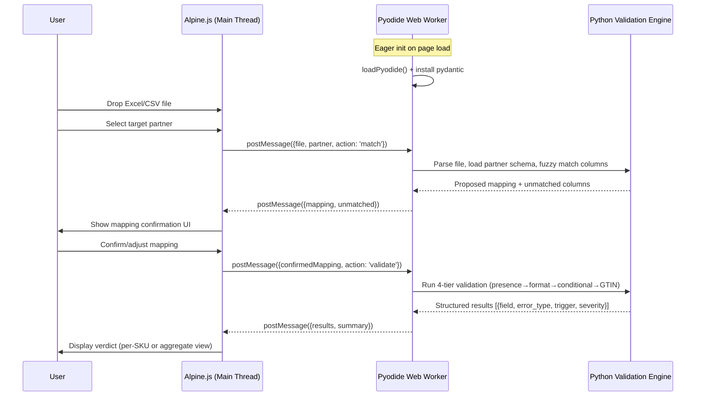

# feat: Item Setup Form Pre-flight

## Summary

Build a client-side readiness tool powered by a Python validation engine running in-browser via Pyodide Web Worker. The engine validates product master data against codified YAML partner schemas (Walmart, Costco, UNFI, KeHE) through a four-tier topology (presence → format → conditional → GTIN hierarchy). The frontend uses Vite + Alpine.js + Tailwind CSS v4 with Lailara design tokens. Six deliverables ship together: YAML schema library, Pydantic v2 validation engine, browser-based readiness tool, paired schema-diff view, click-based audit CLI, and Cinderhaven case study page.

---

## Problem Frame

See origin document for the full pain narrative (see origin: `docs/brainstorms/2026-06-04-item-setup-preflight-requirements.md`). In brief: specialty food brands fill different item setup forms for each retailer/distributor, the forms bounce because of missing fields or GTIN hierarchy mismatches, and missed category-review windows forfeit 6-12 months of revenue.

---

## Requirements

Carried from origin. R-IDs match the requirements document.

- R1. Accept Excel (.xlsx) and CSV file uploads via drag-and-drop or file picker
- R2. Fuzzy column matching with alias map
- R3. Mapping confirmation step for unmatched columns
- R4. Four-tier validation: presence → format → conditional → GTIN hierarchy
- R5. Structured error record with severity (CRITICAL / WARNING / INFO)
- R6. GTIN hierarchy validates correct unit class per partner
- R7. Reuse GTIN Validator core logic (vendored)
- R8. Two switchable output views: per-SKU verdicts and aggregate summary with user guidance
- R9. Plain-English error messages (structured contract is internal only)
- R10. All validation in browser memory via Pyodide Web Worker
- R11. Paired comparisons: retailer-vs-retailer, distributor-vs-distributor
- R12. Highlight differences in required fields, formats, GTIN hierarchy, conditionals
- R13. Surface whatever channel-type pattern honestly emerges
- R14. YAML partner schemas: required fields, formats, GTIN hierarchy, allowed values, conditionals
- R15. Schemas directionally faithful to real partner form shapes
- R16. YAML readable by practitioners (the config itself is a portfolio artifact)
- R17. CLI: same validation engine, accepts Excel/CSV master export
- R18. CLI uses click + openpyxl, repo-only utility
- R19. Case study: standalone narrative page using Cinderhaven data
- R20. Quantify cost of uncaught errors (velocity, windows, slotting, rework)
- R21. Before/after narrative
- R22. Lailara design system for all visual output
- R23. Self-hosted woff2 fonts

**Origin actors:** A1 (Portfolio visitor/prospect), A2 (Ops/data person), A3 (CEO/founder)
**Origin flows:** F1 (Readiness check — browser), F2 (Schema comparison — browser), F3 (Local audit — CLI)
**Origin acceptance examples:** AE1 (covers R2, R3), AE2 (covers R4, R6), AE3 (covers R4, R5), AE4 (covers R8), AE5 (covers R10)

---

## Scope Boundaries

- Not a PIM — pre-flight check only
- No auto-submission to retailer portals
- No re-deciding physical field values (Dimension & Weight Integrity's job)
- No general product-data completeness scoring (PDH's job)
- No parsing each partner's completed proprietary workbook
- No real-time portal integration or API connections
- No user accounts, saved sessions, or persistence

### Deferred to Follow-Up Work

- Pyodide IndexedDB caching for warm-start optimization: separate iteration once cold path is stable
- Additional partner schemas beyond the four: future extension of the YAML library
- PDF export of readiness verdicts: future iteration

---

## Context & Research

### Relevant Code and Patterns

- **GTIN Validator** (`C:\Users\mssha\projects\published\gtin-validator\gtin_core.py`): Core functions `validate_single_gtin()`, `validate_batch()`, `calculate_check_digit()`. Supports GTIN-8/12/13/14. Vendor into `src/engine/gtin/`.
- **Cinderhaven product master** (`C:\Users\mssha\projects\archived\product-data-audit-queries\cinderhaven_product_master.csv`): 90 SKUs, 25 columns. Has gtin14, upc, case dimensions, weights, case_pack_qty, nutritional data. ~30% incomplete dims, no allergen column.
- **D&W Integrity fields** (schema-stable): `case_gross_weight_lb`, `case_length_in`, `case_width_in`, `case_height_in`, `case_pack_qty`. Types locked; data not flowing yet.

### Institutional Learnings

- **SheetJS date parsing timezone bug** (from data-differences-tool): Always use UTC methods (`getUTCFullYear`, etc.) when extracting dates from SheetJS Date objects. Excel serial date epoch offset is 25569. Use `cellDates: true`. (High severity — date fields appear in item setup forms.)
- **CSS design token drift** (from sku-rationalization-framework): All hex values belong in one place — the Tailwind `@theme` config. Grep for raw hex values outside the config before milestone commits.
- **Dual-engine anti-pattern** (from retailer-scorecard-renegotiation-simulator): Validates the Pyodide decision. Do not reimplement any validation logic in JS/Alpine.js, even for "simple" operations like counting errors by severity.
- **Vite defineConfig** (from where-the-money-comes-from): Import from `vitest/config` not `vite` when adding test configuration.

### External References

- Pyodide 0.29.4 (stable, Python 3.13): pydantic-core Emscripten wheels confirmed at `pypi.anaconda.org/pyodide/simple/pydantic-core/`
- Pydantic v2 pin strategy: `pydantic==2.10.5` with Pyodide 0.29.4's bundled pydantic-core (version skew issue: pyodide-recipes#162)
- Tailwind CSS v4: first-party Vite plugin, `@theme` directives replace `tailwind.config.js`
- Alpine.js 3.15.x: `Alpine.store()` for shared state, `Alpine.data()` for component logic
- Vite 8.0.x: Rolldown-based, `worker.rolldownOptions` replaces deprecated `worker.rollupOptions`

---

## Key Technical Decisions

- **Pin Pyodide 0.29.4 + pydantic==2.10.5:** Emscripten wheels for pydantic-core exist and work. Do not let micropip resolve to latest pydantic from PyPI — version skew with bundled pydantic-core. Fallback if v2 proves problematic: attrs + cattrs (pure Python).
- **CDN loading for Pyodide:** Load from `cdn.jsdelivr.net/pyodide/v0.29.4/full/`. Keeps build small, leverages CDN caching for repeat visitors. No self-hosting the ~10MB WASM payload.
- **Tailwind CSS v4 with @theme directives:** Lailara design tokens defined via CSS `@theme` blocks (not a JS config file). All hex values in one `@theme` declaration. This is the single source of truth for colors, replacing the old `tailwind.config.js` pattern.
- **Module-type Web Worker:** Pyodide requires ES module workers (`{ type: 'module' }`). Worker + main thread communicate via promise-wrapped postMessage with unique IDs.
- **Two-round-trip worker flow:** (1) User drops file + selects partner → worker parses headers and returns proposed column mapping → UI shows confirmation. (2) User confirms mapping → worker runs validation → results returned. Keeps all logic in Python.
- **HTML preload links for cold-start:** `<link rel="preload">` for `pyodide.asm.wasm` and `pyodide.asm.mjs`. Start worker eagerly on page load, not on first user action. Show phased loading status.
- **Vite multi-page:** Three HTML entry points (readiness tool, schema-diff, case study) configured via `build.rolldownOptions.input`.

---

## Open Questions

### Resolved During Planning

- **Pydantic v2 + Pyodide compatibility:** Confirmed. Official Emscripten wheels exist for pydantic-core. Pin `pydantic==2.10.5` with Pyodide 0.29.4.
- **Tailwind v4 config approach:** `@theme` directives in CSS replace the JS config file. Lailara tokens go in `src/css/main.css`.

### Deferred to Implementation

- **Full fuzzy alias map:** The complete mapping of common column name variants to schema fields across all four partners. Build incrementally — start with Walmart's most common aliases, extend as schemas are added.
- **Conditional rule complexity:** How deep the cross-field conditional trees go for each partner (e.g., Costco's club-pack-specific fields). Discover during schema codification.
- **Channel-pattern headline decision:** Whether the distributor-similarity finding is strong enough to headline the piece or sits as a mid-piece reveal. Decide once all four schemas are codified and the pattern (or its absence) is visible.

---

## Output Structure

```
item-setup-form-preflight/
├── index.html                        # Readiness tool (main entry)
├── schema-diff/
│   └── index.html                    # Paired schema-diff view
├── case-study/
│   └── index.html                    # Cinderhaven case study
├── src/
│   ├── engine/                       # Python validation engine
│   │   ├── __init__.py
│   │   ├── models.py                 # Pydantic models, error contract types
│   │   ├── validators.py             # Four-tier validation logic
│   │   ├── schema_loader.py          # YAML → validated config
│   │   ├── column_matcher.py         # Fuzzy column matching
│   │   ├── file_parser.py            # Excel/CSV → headers + rows
│   │   └── gtin/                     # Vendored GTIN validator
│   │       ├── __init__.py
│   │       └── gtin_core.py
│   ├── schemas/                      # YAML partner specs
│   │   ├── walmart.yaml
│   │   ├── costco.yaml
│   │   ├── unfi.yaml
│   │   └── kehe.yaml
│   ├── cli/                          # Audit CLI
│   │   ├── __init__.py
│   │   └── audit.py
│   ├── js/                           # Frontend JavaScript
│   │   ├── main.js                   # Alpine.js setup, store, start
│   │   ├── worker-api.js             # Promise-wrapped Worker comms
│   │   └── components/               # Alpine.data() registrations
│   │       ├── file-upload.js
│   │       ├── column-mapper.js
│   │       ├── partner-selector.js
│   │       ├── results-display.js
│   │       └── schema-diff.js
│   ├── css/
│   │   └── main.css                  # @import "tailwindcss" + @theme tokens
│   └── workers/
│       └── pyodide-worker.mjs        # Pyodide Web Worker
├── data/
│   └── cinderhaven/
│       └── product_master.csv        # 90-SKU master for case study
├── fonts/                            # Self-hosted woff2
│   ├── PlayfairDisplay-*.woff2
│   └── SourceSans3-*.woff2
├── tests/
│   ├── test_models.py
│   ├── test_validators.py
│   ├── test_schema_loader.py
│   ├── test_column_matcher.py
│   ├── test_file_parser.py
│   └── test_gtin.py
├── vite.config.js
├── package.json
└── pyproject.toml
```

---

## High-Level Technical Design

> *This illustrates the intended approach and is directional guidance for review, not implementation specification. The implementing agent should treat it as context, not code to reproduce.*



**Validation Tier Topology (executed in order — later tiers skip fields that failed earlier):**

```
Tier 1: PRESENCE     — Is the field populated? (per partner's required-field list)
         ↓ pass
Tier 2: FORMAT       — Does the value match the expected format/mask?
         ↓ pass
Tier 3: CONDITIONAL  — Cross-field logic trees (e.g., Refrigerated → temp fields)
         ↓ pass
Tier 4: GTIN HIERARCHY — Does the GTIN resolve to the correct unit class per partner?
```

---

## Implementation Units

### U1. Project Foundation — Vite + Tailwind v4 + Alpine.js + Pyodide Worker Scaffold

**Goal:** Establish the build toolchain and prove the Pyodide-in-Worker pattern works with a minimal round-trip (send data to worker, run trivial Python, get result back).

**Requirements:** R10, R22, R23

**Dependencies:** None

**Files:**
- Create: `package.json`, `vite.config.js`, `pyproject.toml`
- Create: `index.html`, `schema-diff/index.html`, `case-study/index.html` (skeleton pages)
- Create: `src/css/main.css` (Tailwind v4 `@import` + `@theme` with full Lailara palette)
- Create: `src/js/main.js` (Alpine.js init + store skeleton)
- Create: `src/js/worker-api.js` (promise-wrapped postMessage with ID correlation)
- Create: `src/workers/pyodide-worker.mjs` (load Pyodide, install pydantic, echo test)
- Create: `fonts/` directory with self-hosted Playfair Display + Source Sans 3 woff2 files

**Approach:**
- Initialize npm project with `vite`, `alpinejs`, `@tailwindcss/vite` as dev/runtime deps
- Initialize Python project with `pyproject.toml` listing pydantic, pyyaml, click, openpyxl as dependencies
- Tailwind v4: `@import "tailwindcss"` in `main.css` with `@theme` block mapping every Lailara token (Canvas, London greyscale, Chicago navy, Hong Kong teal, Singapore orange, Tokyo berry, New York amber, semantic status colors, dark card tokens)
- Pyodide loaded from CDN (`cdn.jsdelivr.net/pyodide/v0.29.4/full/`)
- Worker uses module type (`{ type: 'module' }`)
- `<link rel="preload">` for pyodide.asm.wasm and pyodide.asm.mjs in HTML head
- Alpine store tracks `pyodideReady`, `loadingStatus` for phased loading feedback
- Prove the round-trip: main thread sends a number, worker runs `2 + 2` in Python, result comes back
- Download and self-host woff2 fonts, reference in `main.css` `@font-face` rules
- Multi-page Vite config with three HTML entry points

**Patterns to follow:**
- Pyodide official Web Worker pattern (module worker + postMessage + ID correlation)
- Lailara design system token definitions (read from `LAILARA_DESIGN_SYSTEM.md`)
- Vite multi-page pattern via `build.rolldownOptions.input`

**Test scenarios:**
- Happy path: Vite dev server starts, index.html loads, Tailwind classes render correctly, fonts load
- Happy path: Pyodide Worker initializes, round-trip echo test returns correct result
- Edge case: Pyodide loading shows phased status messages (downloading, loading packages, ready)
- Error path: Worker creation fails on browser without module worker support — graceful fallback message

**Verification:**
- `npm run dev` serves all three pages with correct Lailara styling and fonts
- Browser console shows Pyodide ready message after ~5-7 seconds cold start
- Worker round-trip returns a result from Python code

---

### U2. Validation Engine Core + Walmart Schema

**Goal:** Build the four-tier validation engine with Pydantic v2 models and the structured error contract. Codify Walmart's Item 360 schema as the reference YAML spec. Vendor the GTIN Validator.

**Requirements:** R4, R5, R6, R7, R14, R15, R16

**Dependencies:** None (Python-only; no UI dependency)

**Files:**
- Create: `src/engine/__init__.py`
- Create: `src/engine/models.py` (Pydantic models for error contract, schema config, validation result)
- Create: `src/engine/validators.py` (four-tier validation topology)
- Create: `src/engine/schema_loader.py` (YAML → Pydantic config objects)
- Create: `src/engine/gtin/__init__.py`, `src/engine/gtin/gtin_core.py` (vendored)
- Create: `src/schemas/walmart.yaml` (Walmart Item 360 spec)
- Test: `tests/test_models.py`, `tests/test_validators.py`, `tests/test_schema_loader.py`, `tests/test_gtin.py`

**Approach:**
- **Error contract model:** Pydantic model with fields: `field` (str), `error_type` (enum: PRESENCE_MISSING, FORMAT_INVALID, CONDITIONAL_REQUIREMENT_MISSING, GTIN_HIERARCHY_WRONG), `trigger` (optional str — the condition that activated), `severity` (enum: CRITICAL, WARNING, INFO), `message` (str — plain-English explanation)
- **Schema config model:** Pydantic model representing a partner's spec loaded from YAML. Contains: partner name, required fields (with category conditions), format masks (regex patterns per field), conditional rules (field → trigger → required fields), GTIN hierarchy expectation (which unit class the primary GTIN should resolve to)
- **Validation topology:** Process tiers in order. Each tier yields zero or more error records. Fields that fail an earlier tier are skipped in later tiers (no cascading noise). Return a flat list of all errors plus a summary (total fields checked, pass/fail counts per tier, overall verdict).
- **YAML schema format:** Human-readable, practitioner-oriented. Structure: `partner`, `required_fields` (list with optional `category` condition), `format_rules` (field → regex + description), `conditional_rules` (trigger_field → trigger_value → required_fields), `gtin_hierarchy` (expected_level, expected_format).
- **Walmart schema:** Codify the real shape of Item 360 — consumer-unit-first GTIN expectation (UPC-12/GTIN-12), dimension format masks, required nutritional fields, conditional rules for storage type and hazmat.
- **GTIN Validator:** Copy `gtin_core.py` from the published project. Wrap with a thin adapter that checks hierarchy level (GTIN-8/12/13/14 indicator digit) against the partner's expectation.

**Execution note:** Write validation engine tests first for the four-tier topology, then implement to pass them.

**Patterns to follow:**
- GTIN Validator source at `published/gtin-validator/src/gtin_core.py`
- Pydantic v2 model validators and `@field_validator` decorators

**Test scenarios:**
- Happy path: Valid product record passes all four tiers for Walmart — returns empty error list, overall PASS verdict
- Happy path: Schema loader reads `walmart.yaml` and produces a valid config object with all sections populated
- Covers AE2: SKU with valid UPC-12 passes GTIN check for Walmart (consumer-unit-first)
- Covers AE3: Product with storage_type "Refrigerated" but missing temp fields → CONDITIONAL_REQUIREMENT_MISSING with CRITICAL severity
- Edge case: Product with all fields present but GTIN check-digit invalid → FORMAT_INVALID from GTIN validator
- Edge case: Field fails Tier 1 (missing) — verify it is NOT also flagged at Tier 2/3/4 (no cascading noise)
- Edge case: Empty product record (all fields null) → presence errors only, no format/conditional/GTIN errors
- Error path: Malformed YAML schema file → clear error message naming the file and parse location
- Error path: Unknown field referenced in conditional rule → validation-time warning

**Verification:**
- `pytest tests/` passes with all scenarios green
- Walmart schema is readable by a human — a practitioner would recognize the field requirements
- GTIN validator correctly identifies UPC-12 vs GTIN-14 hierarchy level

---

### U3. File Input + Fuzzy Column Matching

**Goal:** Build the column matching engine that auto-maps uploaded file headers to schema fields using a fuzzy alias map, and surfaces unmatched columns for manual correction.

**Requirements:** R1, R2, R3

**Dependencies:** U2 (needs schema config to know expected fields)

**Files:**
- Create: `src/engine/column_matcher.py`
- Create: `src/engine/file_parser.py` (Excel/CSV → headers + rows, using openpyxl for xlsx)
- Test: `tests/test_column_matcher.py`, `tests/test_file_parser.py`

**Approach:**
- **File parser:** Accept file bytes + format hint. For CSV: standard library `csv` module. For Excel: `openpyxl` (works in both native Python and Pyodide via micropip). Return headers list + data rows as list of dicts.
- **Alias map:** A dictionary mapping normalized field keys to lists of known aliases. Normalize both the alias and the uploaded header (lowercase, strip whitespace, remove special chars) before matching. Start with Walmart-specific aliases, extend per-partner in U5.
- **Matching algorithm:** (1) Exact match after normalization. (2) Substring containment (e.g., "width" in "Item Width (in)"). (3) If ambiguous, return candidates ranked by similarity. Never silently assign an ambiguous match — surface it for confirmation.
- **Return shape:** List of `{schema_field, uploaded_header, confidence, status}` where status is `matched`, `ambiguous`, or `unmatched`. Unmatched schema fields and unmatched uploaded columns are both surfaced.
- **Date handling:** When openpyxl parses date cells, ensure timezone-aware handling (openpyxl can return timezone-naive datetime objects). Document the quirk at the parse call site.

**Patterns to follow:**
- Python `difflib.SequenceMatcher` for fuzzy string matching (no external dependency)

**Test scenarios:**
- Covers AE1: File with "Item Width (in)", "Gross Wt", "UPC Number" → auto-matches to width, weight, GTIN fields
- Happy path: File with exact schema field names → all matched with high confidence
- Edge case: Duplicate column names in uploaded file → flagged as ambiguous
- Edge case: File with zero matchable columns → all fields unmatched, clear messaging
- Edge case: Case mismatch ("ITEM WIDTH" vs "item_width") → still matches after normalization
- Edge case: Excel file with date columns → parsed correctly using UTC methods
- Error path: Empty file (no rows) → clear error, not a crash
- Error path: File with headers but no data rows → returns headers with mapping, warns about empty data

**Verification:**
- Column matcher handles the common alias variants documented in the brief (width, weight, GTIN, case pack)
- No silent drops — every uploaded column and every schema field appears in the result
- Tests pass for both CSV and Excel input formats

---

### U4. Readiness Tool UI + Pyodide Integration

**Goal:** Wire the full readiness-check flow: file drop → column mapping confirmation → partner selection → validation via Pyodide Worker → results display in both output views.

**Requirements:** R1, R3, R4, R8, R9, R10

**Dependencies:** U1 (Vite + Alpine + Worker scaffold), U2 (validation engine), U3 (column matcher)

**Files:**
- Create: `src/js/components/file-upload.js` (Alpine.data — drag-and-drop + file picker)
- Create: `src/js/components/column-mapper.js` (Alpine.data — mapping confirmation UI)
- Create: `src/js/components/partner-selector.js` (Alpine.data — partner choice with descriptions)
- Create: `src/js/components/results-display.js` (Alpine.data — per-SKU and aggregate views)
- Modify: `src/js/main.js` (Alpine.store workflow state: currentStep, fileData, mapping, partner, results)
- Modify: `src/js/worker-api.js` (add `matchColumns()` and `validate()` methods)
- Modify: `src/workers/pyodide-worker.mjs` (handle 'match' and 'validate' actions, load engine + schemas)
- Modify: `index.html` (full readiness tool page layout)

**Approach:**
- **Workflow state:** Alpine.store with `currentStep` (1=upload, 2=partner, 3=mapping, 4=validating, 5=results), `fileData`, `selectedPartner`, `columnMapping`, `results`, `viewMode` ('sku' | 'aggregate')
- **Step 1 — File upload:** Drag-and-drop zone with `@drop.prevent` + file picker fallback. Read file as ArrayBuffer. Transfer to worker using Transferable Objects (zero-copy).
- **Step 2 — Partner selection:** Four cards (Walmart, Costco, UNFI, KeHE) with brief descriptions of each partner's form type.
- **Step 3 — Column mapping:** Worker returns proposed mapping. UI shows matched columns (green), ambiguous (yellow, with dropdown to pick), unmatched (red, with dropdown to assign or skip). Confirm button.
- **Step 4 — Validation:** Loading spinner with "Validating N SKUs against [Partner]..." message. Worker runs full four-tier validation.
- **Step 5 — Results:** Two view tabs. Per-SKU view: card per SKU with pass/fail badge, expandable error list grouped by severity. Aggregate view: summary banner ("14 of 20 ready"), most common failure types, drill-down. Explain when each view is useful.
- **Worker integration:** Worker writes file to Pyodide FS (`pyodide.FS.writeFile`), loads the Python engine and target schema, runs matching or validation, returns JSON via postMessage.
- **All severity display:** CRITICAL items first (red badge), WARNING items second (orange badge), INFO items last (blue badge). Use Lailara semantic status colors.

**Patterns to follow:**
- Alpine.js drag-and-drop with `@dragover.prevent` + `:class` for visual feedback
- Alpine.store() for cross-component shared state
- Worker API with promise-wrapped postMessage (from U1)
- Lailara semantic status colors (Pass/Warn/Fail/Info)

**Test scenarios:**
- Covers AE4: 20 SKUs validated against Walmart → aggregate view shows "14 of 20 SKUs ready" with summary of common failures and drill-down
- Covers AE5: Validation completes even if network drops after Pyodide loaded — all processing in browser memory
- Happy path: Full flow from file drop to results display works end-to-end with Walmart schema
- Happy path: User switches between per-SKU and aggregate views — both render correctly
- Edge case: File with single SKU → per-SKU view shows one card, aggregate view shows 1/1
- Edge case: All SKUs pass validation → success state, no error cards, clear "all ready" message
- Edge case: All SKUs fail validation → clear failure state with prioritized error list
- Edge case: Large file (500 rows) → loading state visible, UI responsive (Worker doesn't block main thread)
- Error path: Worker fails mid-validation → error state with retry option, not a blank screen

**Verification:**
- Full readiness-check flow works end-to-end in browser with Walmart schema
- Both output views display correctly with proper severity coloring
- Pyodide Worker doesn't block UI — loading indicators and transitions remain smooth
- Product master data never leaves browser memory (no network requests during validation)

---

### U5. Remaining Partner Schemas — Costco, UNFI, KeHE

**Goal:** Codify the three remaining partner schemas in YAML. Costco is the critical one — its GTIN hierarchy divergence (case/pallet GTIN-14 vs Walmart's consumer-unit UPC-12) is the credibility marker of the piece.

**Requirements:** R6, R14, R15, R16

**Dependencies:** U2 (schema format and validation engine established with Walmart)

**Files:**
- Create: `src/schemas/costco.yaml`
- Create: `src/schemas/unfi.yaml`
- Create: `src/schemas/kehe.yaml`
- Modify: `src/engine/column_matcher.py` (extend alias map with partner-specific column names)
- Test: `tests/test_partner_schemas.py`

**Approach:**
- **Costco:** Club-pack-first model. Primary GTIN must resolve to case/pallet level (GTIN-14 with indicator digit 1-8), not consumer unit. Club-pack-specific fields (inner pack count, club pack dimensions). Different dimension format expectations. Conditional rules for club membership tier.
- **UNFI:** Broadline distributor new-item form. Heavy on case logistics (case pack, case dimensions, ti/hi, pallet weight), cost tiers (wholesale, list, MAP), and promo/deal codes. Structurally similar to KeHE.
- **KeHE:** Broadline distributor new-item form. Similar structure to UNFI — case logistics, cost tiers, promo codes. Different field names and conditional triggers, but the structural similarity to UNFI should be evident in the YAML.
- **Schema fidelity:** Directionally faithful to the real form shapes. The GTIN hierarchy difference between Walmart and Costco must be genuinely present and correctly encoded. The distributor similarity must emerge honestly from faithful codification.
- **Column matcher extension:** Add partner-specific aliases (e.g., Costco uses "Club Pack Qty" not "Case Pack").

**Patterns to follow:**
- `src/schemas/walmart.yaml` structure established in U2

**Test scenarios:**
- Covers AE2: SKU with valid UPC-12 validated against Costco → CRITICAL failure on GTIN hierarchy (expects GTIN-14 case-level, got consumer-unit UPC-12)
- Happy path: Same SKU passes Walmart but fails Costco on GTIN hierarchy — the core divergence is demonstrated
- Happy path: UNFI and KeHE schemas load and validate without errors
- Happy path: Product passing UNFI validation also passes KeHE with minimal additional gaps (structural similarity)
- Edge case: SKU with GTIN-14 (case level) passes Costco but fails Walmart (expects UPC-12)
- Edge case: Costco-specific conditional rules (club membership fields) trigger correctly

**Verification:**
- All four schemas load, parse, and validate correctly
- The GTIN hierarchy divergence between Walmart and Costco is real and demonstrable
- The structural similarity between UNFI and KeHE is visible in the YAML structure
- Column matcher handles partner-specific aliases for all four

---

### U6. Paired Schema-Diff View

**Goal:** Build the interactive schema comparison page showing retailer-vs-retailer (Walmart vs Costco) and distributor-vs-distributor (UNFI vs KeHE) paired comparisons. Surface whatever channel-type pattern honestly emerged from the four schemas.

**Requirements:** R11, R12, R13, R22

**Dependencies:** U1 (Vite + Alpine), U5 (all four schemas codified)

**Files:**
- Create: `src/js/components/schema-diff.js` (Alpine.data — paired comparison logic)
- Modify: `schema-diff/index.html` (full page layout)
- Modify: `src/workers/pyodide-worker.mjs` (add 'diff' action — load schemas, compute field differences)

**Approach:**
- **Data source:** Worker loads all four YAML schemas via Pyodide, computes the diff data (shared fields, unique fields, format differences, GTIN hierarchy differences, conditional rule differences) for each pair, returns as JSON.
- **Two comparison panels:** Retailer pair (Walmart vs Costco) and Distributor pair (UNFI vs KeHE). Each panel shows: shared required fields, fields unique to each partner, format differences, GTIN hierarchy expectations, conditional rules.
- **Highlighting:** Differences highlighted with Lailara semantic colors. Shared fields in neutral, unique fields in partner-specific colors, GTIN hierarchy divergence in red accent (the critical finding).
- **Channel-type pattern:** If the schemas show distributor similarity > retailer similarity, call it out with a concise annotation. If not, describe what actually emerged. The annotation is data-derived, not hardcoded.
- **Click-to-pin:** Click a field to see its full spec from each partner side-by-side on a dark callout card (per Lailara interaction pattern).

**Patterns to follow:**
- Lailara click-to-pin interaction pattern (dim non-selected to 0.2-0.3 opacity, dark callout card)
- Lailara semantic status colors for difference highlighting

**Test scenarios:**
- Happy path: Schema-diff page loads, both comparison panels render with correct data
- Happy path: Walmart vs Costco shows GTIN hierarchy divergence prominently
- Happy path: UNFI vs KeHE shows structural similarity in case logistics fields
- Edge case: Click-to-pin on a field shows detailed spec from both partners on dark card
- Edge case: All shared fields between UNFI and KeHE display correctly (high overlap expected)

**Verification:**
- Both paired comparisons render with accurate data from the YAML schemas
- GTIN hierarchy difference is visually prominent in the retailer comparison
- Whatever pattern emerged is honestly annotated, not forced
- Click-to-pin interaction follows Lailara spec (opacity dim, dark card, 200ms transition)

---

### U7. Audit CLI

**Goal:** Build the repo-only command-line utility that runs the same Python validation engine against a local master export file.

**Requirements:** R17, R18

**Dependencies:** U2 (validation engine), U5 (all partner schemas)

**Files:**
- Create: `src/cli/__init__.py`
- Create: `src/cli/audit.py` (click CLI entry point)
- Modify: `pyproject.toml` (add `[project.scripts]` entry for CLI)
- Test: `tests/test_cli.py`

**Approach:**
- **Interface:** `item-preflight audit --partner walmart --file master.xlsx` — accepts partner name and file path. Optional `--format` flag to choose output format (table, json). Default is a formatted table.
- **Output:** Per-SKU readiness verdict with error list, followed by aggregate summary. Same information as the browser tool, formatted for terminal.
- **File parsing:** Use openpyxl for Excel, csv module for CSV — same `file_parser.py` from U3.
- **Column matching:** Same fuzzy matcher from U3. In CLI mode, print proposed mapping and prompt for confirmation (or accept with `--accept-mapping` flag).
- **Reuse:** Import directly from `src/engine/` — no duplication of validation logic.

**Patterns to follow:**
- click CLI patterns from the portfolio (Data Hygiene Auditor, GTIN Validator)

**Test scenarios:**
- Happy path: `audit --partner walmart --file test.csv` runs validation and prints readable results
- Happy path: `audit --partner costco --file test.xlsx` works with Excel input
- Happy path: `--format json` outputs structured JSON matching the engine's error contract
- Edge case: `--accept-mapping` flag skips the mapping confirmation prompt
- Error path: File not found → clear error message, exit code 1
- Error path: Unknown partner name → lists available partners, exit code 1
- Error path: File with no parseable data → clear error, not a stack trace

**Verification:**
- CLI produces the same validation results as the browser tool for the same input
- Terminal output is readable and formatted (not raw JSON dump in default mode)
- Exit codes are correct (0 for pass, 1 for errors, 2 for validation failures)

---

### U8. Case Study Page + Cinderhaven Data + Final Polish

**Goal:** Build the narrative case study page using Cinderhaven data, integrate the product master, and do final Lailara design system compliance.

**Requirements:** R19, R20, R21, R22, R23

**Dependencies:** U4 (readiness tool working), U5 (all schemas), U6 (schema-diff view)

**Files:**
- Create: `data/cinderhaven/product_master.csv` (copied from archive, with realistic gaps preserved)
- Modify: `case-study/index.html` (full narrative page)
- Modify: all HTML pages (final design system compliance pass)
- Modify: `src/css/main.css` (any token additions needed for case study elements)

**Approach:**
- **Cinderhaven data:** Copy the 90-SKU product master from the archive. Preserve the ~30% incomplete dimensions and missing allergen column — these are the realistic data gaps the pre-flight catches.
- **Case study narrative:** Three acts. (1) The hook: one Cinderhaven SKU against all four partners — arranged as paired comparisons, not a flat row. Show how the same product is "ready" for some and "not ready" for others. (2) The proof: launch scenario with specific findings — N fields missing for Costco, GTIN at wrong hierarchy level, dimension format failures, the distributor shared-gap pattern. Quantify the cost of submitting uncaught. (3) The evidence: link to the readiness tool and schema-diff view as the engine behind the findings.
- **Margin math:** Frame around Cinderhaven's growth trajectory. Lost launch velocity (weeks × velocity × contribution), missed reset window (6-12 months), slotting paid for empty shelf, rework labor hours.
- **Design compliance:** Audit all pages against Lailara design system. Grep for raw hex values outside `@theme`. Verify fonts load from self-hosted woff2. Check all interactive elements follow click-to-pin pattern. Verify print styles (`@page`, running footer, SVG vectors).
- **Cross-link:** Link readiness tool, schema-diff, and case study to each other. Link back to EDI Pre-flight and GTIN Validator as the "pre-flight family."

**Patterns to follow:**
- Lailara design system (read `LAILARA_DESIGN_SYSTEM.md` for exact tokens, type scale, layout, chart rules, print styles)
- CSS token drift audit procedure (from sku-rationalization-framework learning)
- Economist voice: sober, declarative, data-forward

**Test scenarios:**
- Happy path: Case study page loads with Cinderhaven data, all sections render correctly
- Happy path: Margin math numbers are internally consistent with Cinderhaven's 90 SKUs
- Happy path: All three pages (readiness, schema-diff, case study) cross-link correctly
- Edge case: Case study demonstrates real data gaps (missing allergens, incomplete dimensions) caught by the pre-flight
- Edge case: Print stylesheet produces clean letter-size output with running footer and SVG charts

**Verification:**
- Case study tells the complete narrative arc (hook, proof, evidence)
- No raw hex values outside `@theme` in any CSS file
- All fonts load from self-hosted woff2 (no Google Fonts CDN requests in network tab)
- Lailara design system compliance: correct typography scale, color tokens, layout gaps, border radius
- All three pages work independently and cross-link correctly
- `npm run build` produces a clean `dist/` folder deployable as static files

---

## System-Wide Impact

- **Interaction graph:** Pyodide Worker ↔ Alpine.store is the primary interaction surface. Worker messages trigger store updates which trigger Alpine re-renders. No other middleware or observers.
- **Error propagation:** Python validation errors → structured JSON → Worker postMessage → Alpine store → UI. Worker-level errors (Pyodide crash, OOM) → error state in Alpine store → fallback UI.
- **State lifecycle risks:** File ArrayBuffer is transferred to Worker (neutered in main thread) — do not attempt to re-read it. Pyodide FS state persists across validations within a session — clear between runs if schema changes.
- **API surface parity:** Browser readiness tool and CLI must produce identical validation results for the same input. Both consume the same Python engine.
- **Integration coverage:** End-to-end browser test (file drop → results) is the critical integration scenario. Unit tests cover the Python engine; the integration gap is the Worker communication boundary.
- **Unchanged invariants:** GTIN Validator's public API is not modified — only vendored. Cinderhaven product master data is not modified — only consumed.

---

## Risks & Dependencies

| Risk | Mitigation |
|------|------------|
| Pydantic v2 version skew in Pyodide | Pin exact versions (pydantic==2.10.5). Fallback: attrs + cattrs (pure Python). Test early in U1. |
| Pyodide cold start too slow for portfolio UX | Preload links, eager Worker init, phased loading UI. IndexedDB caching deferred to follow-up. |
| Partner schemas not "directionally real" enough | Research real form shapes before codifying. The GTIN hierarchy difference and conditional rules are the credibility markers — get those right. |
| D&W Integrity fields change after consumption | Build with a seam — consume field names as config, not hardcoded. Reconcile if D&W locks different names. |
| openpyxl availability in Pyodide | Pure Python package — installs via micropip. Test in U1 during Pyodide scaffold. |
| Mobile browser WASM memory limits | Graceful degradation: detect failure, show browser-compat message. Portfolio audience is primarily desktop. |

---

## Documentation / Operational Notes

- README.md to be updated after build with: how to run locally (`npm run dev`), how to build (`npm run build`), how to run CLI (`item-preflight audit`), how to run tests (`pytest`)
- Deploy as static files to portfolio host (Cloudflare Pages or similar)
- URL: `item-setup-preflight.lailarallc.com` (or subdomain per README standard)
- Cross-link with EDI Pre-flight and GTIN Validator in portfolio navigation

---

## Sources & References

- **Origin document:** [docs/brainstorms/2026-06-04-item-setup-preflight-requirements.md](docs/brainstorms/2026-06-04-item-setup-preflight-requirements.md)
- **GTIN Validator source:** `published/gtin-validator/gtin_core.py`
- **Cinderhaven master:** `archived/product-data-audit-queries/cinderhaven_product_master.csv`
- **Pyodide docs:** https://pyodide.org/en/stable/
- **Pydantic v2 Emscripten wheels:** https://pypi.anaconda.org/pyodide/simple/pydantic-core/
- **Alpine.js docs:** https://alpinejs.dev/
- **Tailwind CSS v4:** https://tailwindcss.com/docs/
- **Vite 8.0:** https://vite.dev/
- **Lailara Design System:** `published/lailara-design-system/LAILARA_DESIGN_SYSTEM.md`
